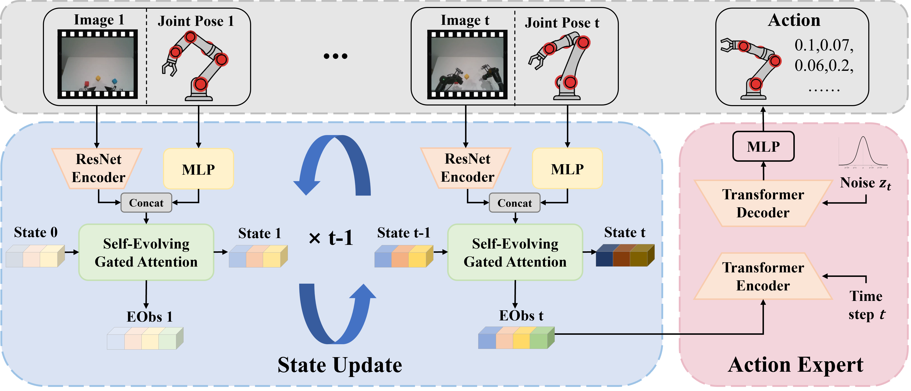
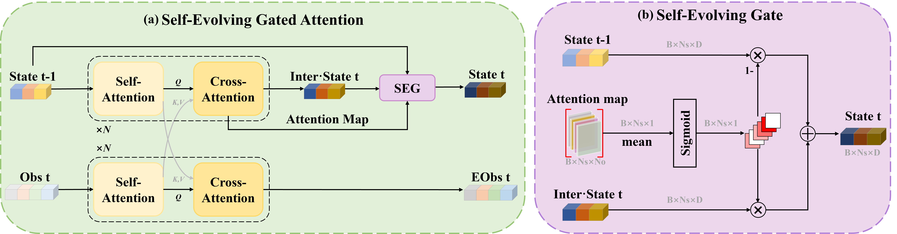

<h1 align="center">
	SeedPolicy: Horizon Scaling via Self-Evolving Diffusion Policy for Robot Manipulation
</h1>

<div align="center">

Youqiang Gui<sup>\*</sup>, Yuxuan Zhou<sup>\*</sup>, Shen Cheng, Xinyang Yuan, Haoqiang Fan, Peng Cheng, Shuaicheng Liu


[arXiv](https://arxiv.org/abs/23xx.xxxxx)

</div>

# 📚 Overview


<div align="left">
    <i>
    <b>Overview of the SeedPolicy framework.</b> 
    The system takes current RGB images and joint poses as input, encoding them via a ResNet Encoder. 
    The core <b>Self-Evolving Gated Attention (SEGA)</b> module (blue box) recursively updates a time-evolving latent state (<i>State t</i>) to capture long-term spatiotemporal dependencies while generating enhanced observation features (<i>EObs<sub>t</sub></i>). 
    These context-rich features are then fed into the Action Expert, a transformer-based diffusion model, to predict a sequence of future actions.
    </i>
</div>

<br>



<div align="left">
    <i>
    (a) SEGA employs a dual-stream design: the <b>State Update</b> stream (top) evolves the latent state (<i>State<sub>t-1</sub></i>) by integrating new observations, while the <b>State Retrieval</b> stream (bottom) utilizes historical context to generate enhanced observation features (<i>EObs<sub>t</sub></i>).
    <br>
    (b) The <b>Self-Evolving Gate (SEG)</b> dynamically computes a gating signal directly from the cross-attention maps. It selectively fuses the intermediate evolved state (Inter &middot; <i>S<sub>t</sub></i>) with the previous state, ensuring only semantically relevant information is preserved while filtering out noise.
    </i>
</div>
<br>


# 🛠️ Installation

Our installation process follows the **RoboTwin** platform standards. 

Please refer to the [RoboTwin Official Documentation](https://robotwin-platform.github.io/doc/index.html) for detailed instructions on:
1.  **Environment Setup**: Setting up the python environment and dependencies.
2.  **Data Collection**: Collecting expert demonstrations.
3.  **Data Processing**: Processing data for Policy/Diffusion Policy (DP) training.

# 🧑🏻‍💻 Usage

## 1. Step One
(Add description for step 1 here)

## 2. Step Two
(Add description for step 2 here)

## 3. Step Three
(Add description for step 3 here)

# 👍 Citation
If you find our work useful, please consider citing:

```bibtex
@article{seedpolicy202x,
  title={SeedPolicy: Horizon Scaling via Self-Evolving Diffusion Policy for Robot Manipulation},
  author={Gui, Youqiang and Zhou, Yuxuan and Cheng, Shen and Yuan, Xinyang and Fan, Haoqiang and Cheng, Peng and Liu, Shuaicheng},
  journal={arXiv preprint arXiv:23xx.xxxxx},
  year={202x}
}
